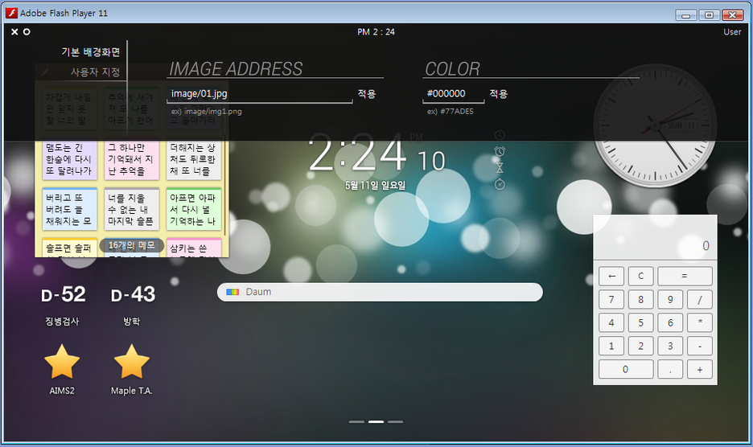

# PIVOT

A widget-based desktop shell for Windows, styled like an early-Android tablet launcher and built with Flash/AS2 between 2010 and 2014. It's a launcher that hosts independent widgets — each with its own settings — across switchable pages.

This was my first long-running project, started in middle school and kept growing through my school years — the one I kept coming back to.

**[Play](https://pivot-14.netlify.app)** · **[Related post](https://canplane.com/2014-05-11-pivot/)**

## Screenshots

## Features

- Widget-first shell: utilities live as independent widgets hosted inside a shared launcher.
- Multi-page workspace: widgets are laid out across several switchable pages, with a page indicator at the bottom.
- Grid-based placement: in edit mode, widgets snap to a grid.
- Shared top bar: a persistent clock and menu, with `e` (or the top-left icon) opening a menu to add widgets, edit the layout, change the background, or see info.
- Widgets: a portal search box (up/down arrow keys cycle through search engines), a digital clock that also functions as an alarm, timer, and stopwatch, an analog clock, notes, day counters, bookmarks, and a calculator.
- Customizable background.

## Running it

Runs in-browser via [Ruffle](https://ruffle.rs) — see the live link above, or open `index.html` locally.

The native build is at `build/v3/beta1-20140514/20140514.exe` (Windows only).

## Build History

`build/` holds every release in the order it actually happened, across the project's several names:

- **v1.0–v1.7** (2010–2011): NAVE, the search-engine switcher described in Notes.
- **v2 (abandoned)**, between v1.6 and v1.7 (2011): an attempt at "NAVE 2.0" with bookmark and dock features, reverted mid-work — the cleanup afterward is what shipped as v1.7. `experimental/` inside it is scattered exploration from the same stretch: a device-specific mockup (for a Cowon D3), an AS3 rewrite attempt, and a separate launcher concept — different directions tried, not a single coherent branch.
- **v3** (2012–2014): renamed PIVOT. Version numbering carries over directly from NAVE (a screenshot from this period reads `PIVOT.14 : 3.0.beta1.20140511_3`), despite two name changes in between. Its milestones (`m1`/`m2`/`m3`): `m1` is the barely-touched 2012 stretch, `m2` is the work resumed in late 2013, `m3` is the final week before Beta 1.
- **NClock** (July 2011, in the middle of the v2 stretch above): the alarm-clock experiment described in Notes — another parallel side-attempt from that same period, kept in its own folder since it was never part of NAVE or PIVOT's own version line.

## Notes

- My actual first program, [Nano Window](https://canplane.com/2009-10-10-nano-window/) (2009), was an attempt at faking an OS interface — not a direct ancestor of what follows, but PIVOT's eventual shape (a shell hosting swappable pieces) ended up closer to that original impulse than to the search-tool origins below.
- Traces back to [NAVE](https://canplane.com/2010-10-24-nave/) (2010), a search-engine switcher rather than a widget shell — the PC it ran on was genuinely slow (Windows XP, slow to boot), and NAVE existed to skip straight to a search without waiting through it.
- The widget-first idea surfaced in 2012, but barely got built — high school kept it to a handful of touches that year. Real work resumed in late 2013, by which point it had become PIVOT.
- The clock widget's alarm/timer/stopwatch functions started as [NClock](https://canplane.com/2011-07-19-nclock/) (2011); it was folded into PIVOT's widget set around 2013–2014.
- I had planned to extend the launcher with support for adding and managing custom widgets, but stopped deliberately in 2014 before getting there — Flash was already a dying platform, and there wasn't much reason to keep investing in a personal launcher over just the desktop.

## About

- **Final version:** `Beta 1` (May 14, 2014)
- **Platform:** Windows
- **Language:** Korean
- **Environment:** Adobe Flash CS6, ActionScript 2, Flash Player 9+
- **Timeline:** 2010-10-24 – 2011-11-05; 2013-11-13 – 2014-05-14

---
[github.com/canplane/PIVOT](https://github.com/canplane/PIVOT)
